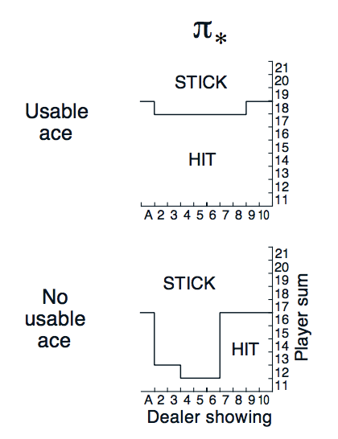

# Blackjack-Reinforcement-Learning

We try reinforcement learning method to game Blackjack. This is a finite-state game to play against with the dealer. The tricky aspect of this game is the ace card. An ace card can serve as value 1 or 11, depending on the situation. To train an optimal strategy of this game, one needs to be carefully about the case when an ace card is 1 (no useable ace) or 11 (usable ace). They represent two different set of states. The game is stochastic in the sense that the card drawing is a random process. However, the power of reinforcement learning has covered stochasticity well. So here is our training, we use Q-learining (QL), Sarsa (SS) and temporal difference (TD) as our training methods, each is trained 1,000,000 times. After training, we use these strategies to play against dealer for 100,000 and record their performance.

After train for  1000000  iterations using Q-Learning\
Out game bot fights against the dealer for  100000  rounds\
Win:  42.744 %\
Draw:  8.690000000000001 %\
Lose:  48.565999999999995 %

After train for  1000000  iterations using Sarsa\
Out game bot fights against the dealer for  100000  rounds\
Win:  42.44 %\
Draw:  7.5920000000000005 %\
Lose:  49.968 %

After train for  1000000  iterations using Temporal Difference\
Out game bot fights against the dealer for  100000  rounds\
Win:  43.646 %\
Draw:  8.298 %\
Lose:  48.056 %

Ok, three methods give more or less the same performance, with temporal difference method gives slightly better result. Next we report their strategy maps (H = hit, S = stick). 

                                            Q-learning
              player (usable ace)                            player (no usable ace)    
          11 12 13 14 15 16 17 18 19 20 21               11 12 13 14 15 16 17 18 19 20 21 
       1   H  S  S  H  S  S  S  S  S  S  S            1   H  H  S  H  H  H  S  S  S  S  S 
       2   H  H  H  H  H  H  H  S  S  S  S            2   H  S  H  S  S  S  S  S  S  S  S  
    D  3   H  H  H  H  H  H  H  S  S  S  S         D  3   H  H  S  S  S  S  S  S  S  S  S  
    e  4   H  H  H  H  H  H  H  S  S  S  S         e  4   H  S  S  S  S  S  S  S  S  S  S  
    a  5   H  H  H  H  H  H  H  H  S  S  S         a  5   H  S  S  S  S  S  S  S  S  S  S  
    l  6   H  H  H  H  H  H  H  H  S  S  S         l  6   H  H  S  S  S  S  S  S  S  S  S  
    e  7   H  H  H  H  H  H  H  S  S  S  S         e  7   H  H  H  H  H  H  S  S  S  S  S  
    r  8   H  H  H  H  H  H  H  S  S  S  S         r  8   H  H  H  H  H  H  H  S  S  S  S  
       9   H  H  H  H  H  H  S  H  S  S  S            9   H  H  H  S  H  H  S  S  S  S  S  
      10   H  H  H  H  H  S  S  S  S  S  S           10   H  H  H  H  H  H  S  S  S  S  S  

                                              Sarsa
              player (usable ace)                            player (no usable ace)    
          11 12 13 14 15 16 17 18 19 20 21               11 12 13 14 15 16 17 18 19 20 21 
       1   H  S  S  S  S  S  S  S  S  S  S            1   H  S  S  S  S  H  S  S  S  S  S  
       2   H  H  H  H  H  H  H  S  S  S  S            2   H  S  S  S  S  S  S  S  S  S  S  
    D  3   H  H  H  H  H  H  H  S  S  S  S         D  3   H  S  S  S  S  S  S  S  S  S  S  
    e  4   H  H  H  H  S  H  H  S  S  S  S         e  4   H  H  S  S  S  S  S  S  S  S  S  
    a  5   H  H  H  H  H  H  H  H  S  S  S         a  5   H  S  S  S  S  S  S  S  S  S  S  
    l  6   H  H  H  H  H  H  H  H  S  S  S         l  6   H  S  S  S  S  S  S  S  S  S  S  
    e  7   H  H  H  H  H  H  S  S  S  S  S         e  7   H  H  H  H  H  H  S  S  S  S  S  
    r  8   H  H  H  H  H  H  H  S  S  S  S         r  8   H  H  H  S  S  H  H  S  S  S  S  
       9   H  H  H  H  H  S  H  S  S  S  S            9   H  S  H  H  S  H  S  S  S  S  S  
      10   H  H  H  H  S  H  S  S  S  S  S           10   H  H  H  S  S  S  S  S  S  S  S  

                                        Temporal Difference
              player (usable ace)                            player (no usable ace)    
          11 12 13 14 15 16 17 18 19 20 21               11 12 13 14 15 16 17 18 19 20 21 
       1   H  H  H  H  H  H  H  S  S  S  S            1   H  H  H  H  H  H  S  S  S  S  S  
       2   H  H  H  H  H  H  H  S  S  S  S            2   H  S  S  S  S  S  S  S  S  S  S  
    D  3   H  H  H  H  H  H  H  S  S  S  S         D  3   H  S  S  S  S  S  S  S  S  S  S  
    e  4   H  H  H  H  H  H  H  S  S  S  S         e  4   H  S  S  S  S  S  S  S  S  S  S  
    a  5   H  H  H  H  H  H  H  H  S  S  S         a  5   H  S  S  S  S  S  S  S  S  S  S  
    l  6   H  H  H  H  H  H  H  S  S  S  S         l  6   H  S  S  S  S  S  S  S  S  S  S  
    e  7   H  H  H  H  H  H  H  S  S  S  S         e  7   H  H  H  H  H  H  S  S  S  S  S  
    r  8   H  H  H  H  H  H  H  S  S  S  S         r  8   H  H  H  H  H  S  S  S  S  S  S  
       9   H  H  H  H  H  H  H  H  S  S  S            9   H  H  H  H  H  S  S  S  S  S  S  
      10   H  H  H  H  H  H  H  S  S  S  S           10   H  H  H  S  S  S  S  S  S  S  S  
      
Three strategy maps are similar to each other, it represents some robustness of these methods. Interestingly, only tempoeral difference method gives consistent result from 

